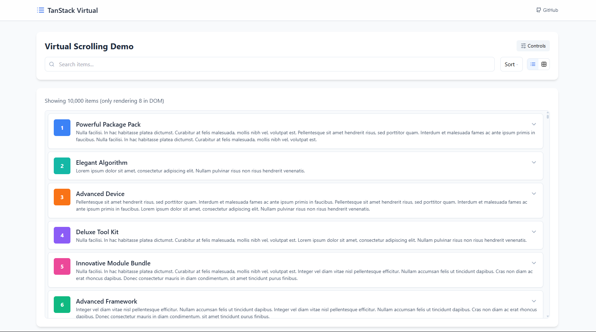

# TanStack Virtualizer Demo

<p align="center">
  
</p>

<p align="center">
  A high-performance React application showcasing TanStack Virtual for efficient rendering of large datasets.
</p>

<p align="center">
  <a href="#features">Features</a> •
  <a href="#demo">Demo</a> •
  <a href="#installation">Installation</a> •
  <a href="#usage">Usage</a> •
  <a href="#technologies">Technologies</a> •
  <a href="#project-structure">Project Structure</a> •
  <a href="#contributing">Contributing</a> •
  <a href="#license">License</a>
</p>

## ✨ Features

- **Virtualized List View** - Efficiently render thousands of items with minimal DOM nodes
- **Virtualized Grid View** - Responsive grid layout with dynamic column count
- **Dynamic Item Sizing** - Automatically adjusts to content height
- **Expandable Items** - Expand/collapse items for additional details
- **Search Functionality** - Filter items by title or description
- **Sorting** - Sort items alphabetically (ascending/descending)
- **Performance Controls** - Adjust item count, overscan, and item height
- **Responsive Design** - Works on all device sizes
- **Beautiful UI** - Modern, clean interface with Tailwind CSS

## 🎮 Demo

<p align="center">
  
</p>

## 📦 Installation

```bash
# Clone the repository
git clone https://github.com/vishal-katta/tanstack-virtualizer-demo.git

# Navigate to the project directory
cd tanstack-virtualizer-demo

# Install dependencies
npm install

# Start the development server
npm run dev
```

## 🚀 Usage

The demo will be running at [http://localhost:5173](http://localhost:5173)

You can:
- Toggle between list and grid views
- Search for specific items
- Sort items alphabetically
- Expand grid items for additional information
- Adjust performance settings via the Controls panel

## 💻 Technologies

- [React 18](https://reactjs.org/) - UI library
- [TypeScript](https://www.typescriptlang.org/) - Type-safe JavaScript
- [TanStack Virtual](https://tanstack.com/virtual) - Virtualization library
- [Vite](https://vitejs.dev/) - Fast development environment
- [Tailwind CSS](https://tailwindcss.com/) - Utility-first CSS framework
- [Lucide React](https://lucide.dev/) - Beautiful icons

## 📂 Project Structure

```
tanstack-virtualizer-demo/
├── public/              # Static assets
│   ├── images/          # Image assets
│   │   └── demo-screenshot.svg   # Demo screenshot
│   ├── favicon.svg      # Site favicon
│   ├── manifest.json    # Web app manifest
│   └── robots.txt       # Search engine instructions
├── src/
│   ├── components/      # React components
│   │   ├── Controls.tsx          # Performance control panel
│   │   ├── Layout.tsx            # Main layout component
│   │   ├── VirtualDemo.tsx       # Main demo component
│   │   ├── VirtualGrid.tsx       # Grid view implementation
│   │   └── VirtualItem.tsx       # Individual list item component
│   ├── utils/
│   │   ├── data.ts               # Data generation utilities
│   │   └── faker.ts              # Fake data generation
│   ├── App.tsx          # Main application component
│   ├── main.tsx         # Application entry point
│   └── index.css        # Global styles
├── index.html           # HTML entry point
├── tsconfig.json        # TypeScript configuration
├── vite.config.ts       # Vite configuration
└── package.json         # Project dependencies
```

## 👥 Contributing

Contributions are welcome! Please feel free to submit a Pull Request.

1. Fork the repository
2. Create your feature branch (`git checkout -b feature/amazing-feature`)
3. Commit your changes (`git commit -m 'Add some amazing feature'`)
4. Push to the branch (`git push origin feature/amazing-feature`)
5. Open a Pull Request

## 📄 License

This project is licensed under the MIT License - see the LICENSE file for details.

---

<p align="center">
  Made with ❤️ by <a href="https://github.com/vishal-katta">Vishal Katta</a>
</p> 